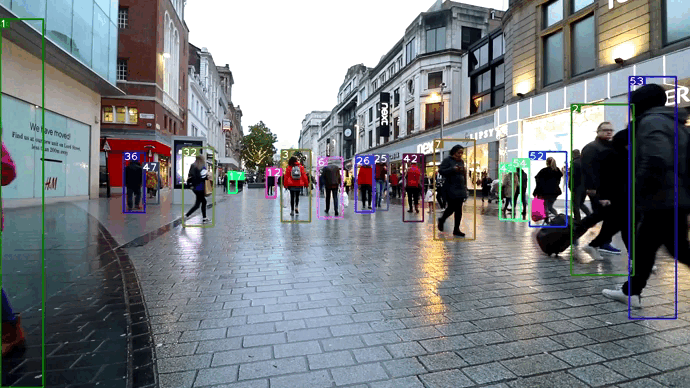

# Deep Sort with PyTorch




This repository is based on the pytorch implementation of Deep SORT: (https://github.com/ZQPei/deep_sort_pytorch.git), the descriptor is either a pretrained VGG19 finetuned on MARKET 1501 data or a U-Net pretrained on clothes data segmentation task and finetuned on Market 1501, both models were trained with a triplet loss. To specify which model to use, please refer to the options of deepsort.py below. Trained models are available (https://drive.google.com/file/d/1UnLqYdZBn8PnYdS4xuRD4XnDg-QMPpZ8/view?usp=share_link), but you can retrain them in the ReID_training.ipynb notebook and visualize the output.

## Dependencies
- python 3 (python2 not sure)
- numpy
- scipy
- opencv-python
- sklearn
- torch >= 0.4
- torchvision >= 0.1
- pillow
- vizer
- edict

## Quick Start
0. Check all dependencies installed
```bash
pip install -r requirements.txt
```

1. Clone this repository
```
git clone git@github.com:Mkenza/pdi_ReID.git
```

2. Download YOLOv3 parameters
```
cd detector/YOLOv3/weight/
wget https://pjreddie.com/media/files/yolov3.weights
wget https://pjreddie.com/media/files/yolov3-tiny.weights
cd ../../../
```

3. Download deepsort parameters ckpt.t7
```
cd deep_sort/deep/checkpoint
# download ckpt.t7 from
https://drive.google.com/drive/folders/1xhG0kRH1EX5B9_Iz8gQJb7UNnn_riXi6 to this folder
cd ../../../
```

4. Compile nms module
```bash
cd detector/YOLOv3/nms
sh build.sh
cd ../../..
```

5. (Optional) Prepare third party submodules

[fast-reid](https://github.com/JDAI-CV/fast-reid)

This library supports bagtricks, AGW and other mainstream ReID methods through providing an fast-reid adapter.

to prepare our bundled fast-reid, then follow instructions in its README to install it.

Please refer to `configs/fastreid.yaml` for a sample of using fast-reid. See [Model Zoo](https://github.com/JDAI-CV/fast-reid/blob/master/docs/MODEL_ZOO.md) for available methods and trained models.

[MMDetection](https://github.com/open-mmlab/mmdetection)

This library supports Faster R-CNN and other mainstream detection methods through providing an MMDetection adapter.

to prepare our bundled MMDetection, then follow instructions in its README to install it.

Please refer to `configs/mmdet.yaml` for a sample of using MMDetection. See [Model Zoo](https://github.com/open-mmlab/mmdetection/blob/master/docs/model_zoo.md) for available methods and trained models.
Run

```
git submodule update --init --recursive
```


6. Run demo
```
usage: deepsort.py [-h]
                   [--fastreid]
                   [--config_fastreid CONFIG_FASTREID]
                   [--mmdet]
                   [--config_mmdetection CONFIG_MMDETECTION]
                   [--config_detection CONFIG_DETECTION]
                   [--config_deepsort CONFIG_DEEPSORT] [--display]
                   [--frame_interval FRAME_INTERVAL]
                   [--display_width DISPLAY_WIDTH]
                   [--display_height DISPLAY_HEIGHT] [--save_path SAVE_PATH]
                   [--cpu] [--camera CAM]
                   VIDEO_PATH

# yolov3 + deepsort
python deepsort.py [VIDEO_PATH]

# yolov3_tiny + deepsort
python deepsort.py [VIDEO_PATH] --config_detection ./configs/yolov3_tiny.yaml

# yolov3 + deepsort on webcam
python3 deepsort.py /dev/video0 --camera 0

# yolov3_tiny + deepsort on webcam
python3 deepsort.py /dev/video0 --config_detection ./configs/yolov3_tiny.yaml --camera 0

# fast-reid + deepsort
python deepsort.py [VIDEO_PATH] --fastreid [--config_fastreid ./configs/fastreid.yaml]

# MMDetection + deepsort
python deepsort.py [VIDEO_PATH] --mmdet [--config_mmdetection ./configs/mmdet.yaml]
```
Use `--display` to enable display.
Results will be saved to `./output/results.avi` and `./output/results.txt`.

All files above can also be accessed from BaiduDisk!
linker：[BaiduDisk](https://pan.baidu.com/s/1YJ1iPpdFTlUyLFoonYvozg)
passwd：fbuw

## Training the RE-ID model
You can retrain the models either with train.py or on the ReID_training.ipynb notebook.

train.py
```
usage: usage: train.py [-h]
		[--data_path DATA_PATH]
		[--margin MARGIN]
		[--num_epochs NUM_EPOCHS]
		[--batch_size BATCH_SIZE]
                [--embed_size EMBED_SIZE]
		[--learning_rate LEARNING_RATE]
		[--cnn_type CNN_TYPE]
```

cnn_type can be vgg19 or unet
data_path is the path to the folder containing train and test datasets (folders named bounding_box_{train/test}/)


## References
- paper: [Simple Online and Realtime Tracking with a Deep Association Metric](https://arxiv.org/abs/1703.07402)

- code: [nwojke/deep_sort](https://github.com/nwojke/deep_sort)

- code pytorch : [ZQPei/deep_sort_pytorch] (https://github.com/ZQPei/deep_sort_pytorch.git)

- paper: [YOLOv3](https://pjreddie.com/media/files/papers/YOLOv3.pdf)

- paper: [Triplet loss] (https://arxiv.org/abs/1703.07737)

- code: [Joseph Redmon/yolov3](https://pjreddie.com/darknet/yolo/)
